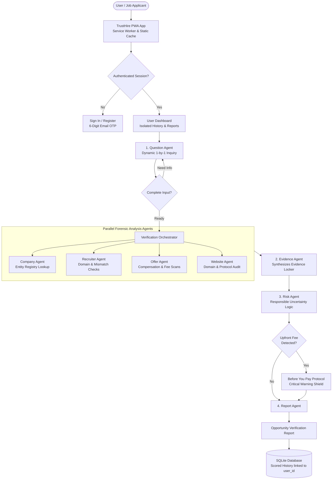

# TrustHire AI — Opportunity Verification System (PWA)

> **"Verify Before You Trust. Verify Before You Pay."**  
> *Domain: Enterprise Productivity / Agentic AI / Progressive Web App (PWA)*

---

## 1. Problem Statement
The modern remote employment ecosystem is experiencing an unprecedented surge in sophisticated hiring fraud:
- **Upfront Fee & Equipment Scams:** Fraudulent recruiters offer high-paying work-from-home positions (e.g., $40–$55/hr) and pressure candidates to wire $150–$500 in "refundable insurance deposits" for home-office MacBooks or specialized software.
- **Brand Impersonation & Free Mailboxes:** Scammers pose as talent acquisition leaders from recognized enterprises (Google, Microsoft, Amazon) while secretly communicating via personal free mailboxes (`@gmail.com`, `@yahoo.com`) or subtle typosquatted domains (`g00gle-careers.live`).
- **Binary Chatbot Failure:** Existing AI tools frequently act as simplistic chat wrappers that hallucinate facts or falsely label legitimate unlisted startups as scams, providing zero transparent forensic proof.

---

## 2. Solution: TrustHire AI
TrustHire AI is an enterprise-grade, multi-agent opportunity verification engine and installable Progressive Web App (PWA). Rather than making unsubstantiated binary claims (*"100% Genuine"* or *"100% Scam"*), TrustHire AI operates on the core philosophy:

> **"Verify the opportunity, rather than detect fake companies."**

The platform executes a multi-step agentic investigation pipeline, catalogs findings into a structured **Evidence Locker**, assigns balanced multi-dimensional risk assessments, enforces the **Before You Pay** safety protocol, and provides isolated per-user verification history under secure authentication.

---

## 3. Security & Authentication Architecture

TrustHire AI is secured with real database authentication, zero plaintext passwords, and isolated session controls:

1. **Database Authentication:**
   - Real user credentials managed in SQLite (`users` and `sessions` tables).
   - Zero hardcoded or default client credentials.
2. **Password Security:**
   - Passwords hashed with high-entropy cryptographic algorithms (`scrypt` / `PBKDF2:SHA-256` via Werkzeug).
   - Plaintext passwords and hashes are never exposed in APIs or server logs.
3. **6-Digit Email OTP Verification:**
   - New accounts are registered with `is_verified = 0`.
   - A cryptographically random 6-digit verification code is generated, salted, and hashed in `otp_codes`.
   - The code is dispatched to the user's real email inbox via TLS SMTP.
   - Enforces 10-minute code expiry, 60-second resend cooldown, single-use invalidation, and maximum attempt caps.
   - Accounts activate (`is_verified = 1`) only upon valid OTP submission.
4. **HTTP-Only Session Management:**
   - Authenticated sessions use cryptographically random 64-character tokens stored in the `sessions` table.
   - Transmitted to browsers via secure HTTP-Only, `SameSite=Lax`, path-scoped cookies (`trusthire_session`).
   - JavaScript cannot access session tokens (protecting against XSS credential theft).
5. **Report Ownership & Data Isolation:**
   - Every verification report is permanently linked to the creator's `user_id` and `user_email`.
   - History retrieval (`GET /api/history`) and report deletion (`DELETE /api/history/:id`) enforce strict user boundaries. Users can only access and delete their own reports.
6. **API Protection:**
   - All private endpoints (`/api/history`, `/api/verify/job-full`, `/api/auth/me`, `/api/user/*`) are protected by a `@login_required` decorator that returns `401 Unauthorized` for missing or invalid sessions.
7. **Rate Limiting:**
   - Automatic rate limiting prevents credential stuffing and OTP spamming (e.g., max 5 failed attempts per 15 minutes).

---

## 4. Progressive Web App (PWA) Capabilities

TrustHire AI is an installable PWA designed for desktop and mobile:
- **Web App Manifest (`manifest.webmanifest`):** Configured with standalone display mode, brand colors (`#090d16`), shortcuts, and responsive 192x192 & 512x512 high-resolution icons.
- **Service Worker (`sw.js`):**
  - Static Asset Caching (Cache-First strategy for CSS, JS, fonts, and images).
  - API Network Bypass (Network-Only strategy for all `/api/*` endpoints to ensure real-time security data).
- **In-App Installation:**
  - Automatically captures the browser's `beforeinstallprompt` event.
  - Displays an **"Install App"** button in the navigation header when available in supported browsers (Chrome, Edge, Android).
  - Can be launched standalone like a native desktop or mobile application.

---

## 5. The Multi-Agent Verification Lifecycle

```
ASK → COLLECT → INVESTIGATE → ANALYZE → DECIDE → EXPLAIN → LOG
```

### Forensic Agent Roles:
1. **`question_agent`**: Dynamically evaluates collected parameters and asks one intelligent question at a time, branching when payment demands or non-standard channels are detected.
2. **`company_agent`**: Cross-correlates claimed corporate entities against verified registries and detects discrepancies with user-provided websites.
3. **`recruiter_agent`**: Distinguishes corporate domains from personal mailboxes, scans for typosquatting, and evaluates mailbox reputation.
4. **`offer_agent`**: Extracts compensation metrics, checks work-from-home feasibility, and identifies upfront payment demands.
5. **`website_agent`**: Evaluates top-level domain churn, HTTPS enforcement, and security properties.
6. **`evidence_agent`**: Synthesizes all forensic findings into the **Evidence Locker** across 4 standardized classifications (`User Provided`, `Verified Evidence`, `AI Analysis`, `Unknown`).
7. **`risk_agent`**: Evaluates evidence across 8 dimensions. Enforces **Negative Testing** (responsible uncertainty handling on sparse inputs).
8. **`report_agent`**: Compiles the comprehensive **Opportunity Verification Report** and formats the deterministic **Agent Investigation Trace**.
9. **`orchestrator`**: Master coordinator managing data flow and state transitions.

---

## 6. Architecture Diagram



---

## 7. Key Features

### 🔍 Conversational "Verify Job Offer"
- Step-by-step inquiry asking one question at a time with option chips.
- Dynamically branches if upfront payment or high-risk communication channels (WhatsApp, Telegram) are selected.

### 🗄️ Evidence Locker
- Every finding is cataloged with:
  - **Finding**: Clear descriptive summary
  - **Source**: Attributed forensic source
  - **Category**: `User Provided`, `Verified Evidence`, `AI Analysis`, `Unknown`
  - **Status**: `Low Concern`, `Needs Verification`, `Warning Indicator`, `High Concern`
  - **Explanation**: Transparent rationale explaining why the artifact matters.

### 🛡️ "Before You Pay" Protocol
- Prominently triggered whenever an upfront payment (equipment fee, training module, security deposit) is detected.
- Outlines why legitimate corporate employers never charge applicants.
- Interactive candidate safety checklist.
- Strict security guarantee: zero financial credentials ever solicited or stored.

### 🧪 Live 20-Case Evaluation Benchmark
- Standardized test runner executing against 20 real-world threat scenarios.
- Verifies 100% accuracy across payment scams, domain impersonation, and ambiguous inputs.

---

## 8. Tech Stack

- **Frontend:** React 19, TypeScript, Vite, Tailwind CSS v4, Lucide React, Framer Motion, PWA Service Worker.
- **Backend:** Python 3.15, Flask REST API, Flask-CORS, Requests, Werkzeug.
- **Database:** SQLite (persisting users, password hashes, OTP codes, user sessions, verification reports, and audit traces).
- **Email Delivery:** Python `smtplib` with TLS encryption (Gmail, SendGrid, Outlook, SES).

---

## 9. Installation & Setup

### Prerequisites
- Python 3.10+
- Node.js 18+ and npm

### 1. Clone & Navigate
```bash
git clone https://github.com/your-username/trusthire.git
cd trusthire
```

### 2. Backend Environment & Setup
```bash
cd backend
python -m pip install flask flask-cors requests werkzeug

# Copy sample environment and configure credentials
cp .env.example .env
```

Configure your `.env` file:
```env
PORT=5000
SECRET_KEY=generate-a-strong-random-key
FRONTEND_URL=http://localhost:3000
SESSION_COOKIE_SECURE=false

# SMTP Email Delivery (e.g. Gmail)
SMTP_HOST=smtp.gmail.com
SMTP_PORT=587
SMTP_USER=your-email@gmail.com
SMTP_PASSWORD=your-16-char-google-app-password
SMTP_FROM=TrustHire AI <no-reply@trusthire.ai>
SMTP_USE_TLS=true
```

Start the backend server:
```bash
python app/main.py
```
*Backend runs on `http://127.0.0.1:5000`.*

### 3. Frontend Setup
```bash
cd ../frontend
npm install
npm run dev -- --port 3000
```
*Frontend runs on `http://localhost:3000`.*

---

## 10. Running Automated Tests

### 1. Backend Security & PWA Auth Suite
```bash
cd backend
python -m unittest tests/test_secure_pwa_auth.py
```
*Validates removed public SMTP endpoints, PBKDF2/scrypt password hashing, OTP verification, cookie sessions, route protection, and user report isolation.*

### 2. 20-Case AI Evaluation Suite
```bash
cd backend
python -m evaluation.eval_runner
```
*Runs the 20-scenario forensic evaluation benchmark (100% pass rate).*

### 3. Frontend Type & Build Check
```bash
cd frontend
npx tsc --noEmit
npm run build
```

---

## 11. Disclaimer
*TrustHire AI provides verification assistance and forensic risk indicators. It does not guarantee that an opportunity or company is legitimate or fraudulent. Candidates should always verify offers independently before transferring funds or sharing sensitive personal data.*
