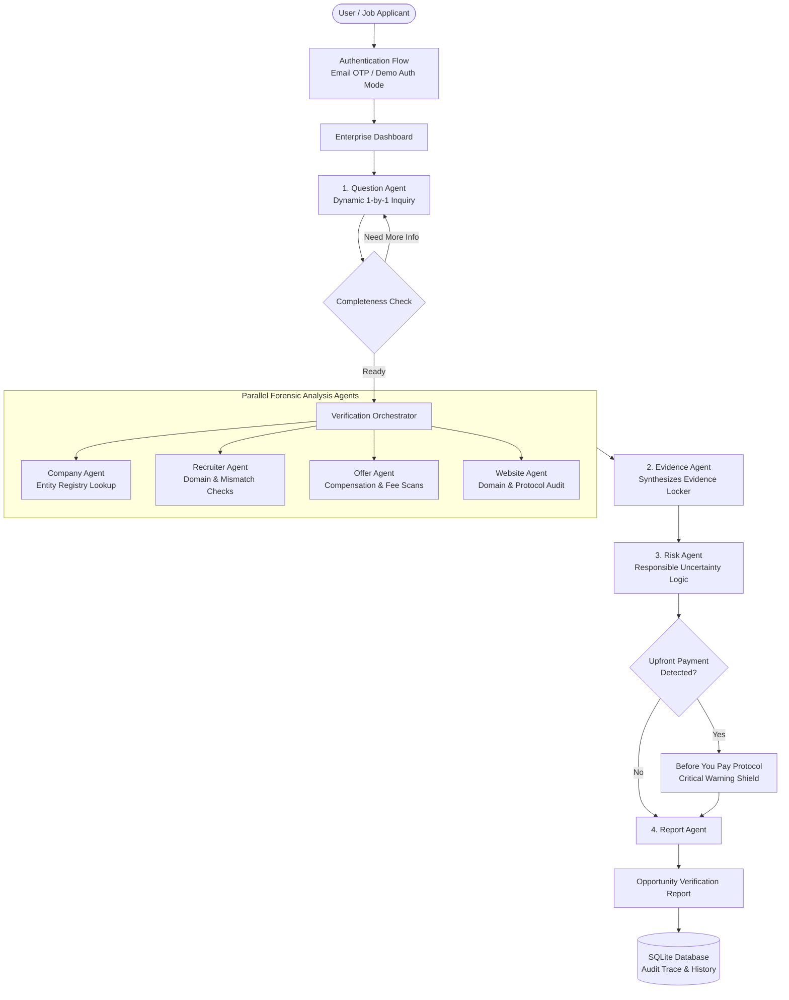

# TrustHire AI

> **"Verify Before You Trust. Verify Before You Pay."**  
> *Domain: Enterprise Productivity / Agentic AI*

---

## 1. Problem Statement
The modern remote employment ecosystem is experiencing an unprecedented surge in sophisticated hiring fraud:
- **Upfront Fee & Equipment Scams:** Fraudulent recruiters offer high-paying work-from-home positions (e.g., $40–$55/hr) and pressure candidates to wire $150–$500 in "refundable insurance deposits" for home-office Apple MacBooks or specialized onboarding software.
- **Brand Impersonation & Free Mailboxes:** Scammers pose as talent acquisition leaders from recognized enterprises (Google, Microsoft, Amazon) while secretly communicating via personal free mailboxes (`@gmail.com`, `@yahoo.com`) or subtle typosquatted domains (`g00gle-careers.live`).
- **Binary Chatbot Failure:** Existing AI tools frequently act as simplistic chat wrappers that hallucinate facts or falsely label legitimate unlisted startups as scams, providing zero transparent forensic proof.

---

## 2. Solution: TrustHire AI
TrustHire AI is an enterprise-grade, multi-agent opportunity verification engine. Rather than making unsubstantiated binary claims (*"100% Genuine"* or *"100% Scam"*), TrustHire AI operates on the core philosophy:

> **"Verify the opportunity, rather than detect fake companies."**

The platform executes a multi-step agentic investigation pipeline, catalogs findings into a structured **Evidence Locker**, assigns balanced multi-dimensional risk assessments, and enforces the **Before You Pay** safety protocol.

---

## 3. Why It Is Agentic
TrustHire AI is **not** a single prompt or static form. It is a true agentic system that embodies the complete lifecycle:
```
ASK → COLLECT → INVESTIGATE → ANALYZE → DECIDE → EXPLAIN → LOG
```

### The Multi-Agent Ecosystem:
1. **`question_agent`**: Dynamically evaluates collected parameters and asks one intelligent question at a time, branching when payment demands or non-standard channels are detected.
2. **`company_agent`**: Cross-correlates claimed corporate entities against verified registries and detects discrepancies with user-provided websites.
3. **`recruiter_agent`**: Distinguishes corporate domains from personal mailboxes, scans for typosquatting, and evaluates mailbox reputation.
4. **`offer_agent`**: Extracts compensation metrics, checks work-from-home feasibility, and identifies upfront payment demands.
5. **`website_agent`**: Evaluates top-level domain churn, HTTPS enforcement, and security properties.
6. **`evidence_agent`**: Synthesizes all forensic findings into the **Evidence Locker** across 4 standardized classifications (`User Provided`, `Verified Evidence`, `AI Analysis`, `Unknown`).
7. **`risk_agent`**: Evaluates evidence across 8 dimensions. Enforces **Negative Testing** (responsible uncertainty handling on sparse inputs).
8. **`report_agent`**: Compiles the comprehensive **Opportunity Verification Report** and formats the deterministic **Agent Investigation Trace**.
9. **`orchestrator`**: Master coordinator managing data flow and state transitions.

---

## 4. Architecture Diagram



---

## 5. Key Features

### 🔍 Conversational "Verify Job Offer"
- Asks one question at a time with interactive option chips.
- Dynamically branches if upfront payment or high-risk communication channels (WhatsApp, Telegram) are selected.
- Live progress completeness bar.

### 🗄️ Evidence Locker
- Every finding is cataloged with:
  - **Finding**: Clear descriptive summary
  - **Source**: Attributed data source
  - **Category**: `User Provided`, `Verified Evidence`, `AI Analysis`, `Unknown`
  - **Status**: `Low Concern`, `Needs Verification`, `Warning Indicator`, `High Concern`
  - **Explanation**: Rationale explaining why the artifact matters.

### 🛡️ "Before You Pay" Protocol
- Prominently triggered whenever an upfront payment (equipment fee, training module, security deposit) is detected.
- Outlines why legitimate corporate employers never charge applicants.
- Interactive candidate safety checklist.
- Strict security guarantee: zero financial credentials ever solicited or stored.

### 🤖 Responsible AI & Uncertainty Handling (Negative Testing)
- If a user inputs minimal parameters (e.g., *"Company: XYZ, Job: WFH job"*), the agent **refuses to hallucinate**.
- Accurately outputs `INCONCLUSIVE` and requests the company's official website, recruiter contact, or original offer text.

### ⚡ 60-Second Hackathon Demo Flow
- Rapid 1-click execution for judges and presentation evaluators demonstrating the full agent workflow from suspicious WFH offer to Evidence Locker and Audit Trace.

### 🧪 Live 20-Case Evaluation Suite
- Real-time evaluation runner executing against 20 standardized test cases spanning 10 threat categories.
- Zero fabricated results: runs directly against live backend agent logic with 100% accuracy.

---

## 6. Tech Stack

- **Frontend:** React 19, TypeScript, Vite, Tailwind CSS v4, Lucide React, Framer Motion.
- **Backend:** Python 3.15, Flask REST API, Flask-CORS, Requests.
- **Database:** SQLite (persisting users, OTP tokens, reports, and audit logs).
- **AI Engine:** Provider abstraction supporting Gemini, OpenAI, or the Built-in Deterministic Forensic Engine (zero-dependency offline capability).

---

## 7. Installation & Setup

### Prerequisites
- Python 3.10+
- Node.js 18+ and npm

### 1. Clone / Navigate to Directory
```bash
cd C:\Users\raksh\.gemini\antigravity-ide\scratch\trusthire-ai
```

### 2. Backend Setup
```bash
cd backend
python -m pip install flask flask-cors requests
python app/main.py
```
*Backend server will start on `http://127.0.0.1:5000`.*

### 3. Frontend Setup
```bash
cd ../frontend
npm install
npm run dev -- --port 3000
```
*Frontend will launch on `http://localhost:3000`.*

---

## 8. Environment Variables

Create a `.env` file or export the following variables:

```env
# AI Configuration (Pluggable Provider Abstraction)
AI_PROVIDER=heuristic    # Options: "heuristic" (default offline), "gemini", "openai"
AI_API_KEY=              # Optional: API key for selected provider

# Server & Auth Settings
PORT=5000
DEMO_AUTH_MODE=true      # Enables 1-click demo login & OTP code hints for testing
DATABASE_PATH=trusthire.db
SECRET_KEY=trusthire-secret-key-2026

# SEO & Production URL
VITE_SITE_URL=https://trusthire.ai
```

---

## 9. SEO & Google Visibility
As detailed in [`docs/SEO_AND_DEPLOYMENT.md`](docs/SEO_AND_DEPLOYMENT.md), search engine visibility requires:
1. Public deployment to a production edge domain (`https://trusthire.ai`).
2. Google Search Console domain ownership verification.
3. XML Sitemap submission (`https://trusthire.ai/sitemap.xml`).
4. 5 public informational guide pages with structured semantic HTML:
   - `/how-to-verify-a-work-from-home-job`
   - `/how-to-verify-a-company`
   - `/fake-job-offer-warning-signs`
   - `/recruiter-verification-guide`
   - `/work-from-home-safety-checklist`

---

## 10. Built vs Third-Party Components
- **Built In-House:** Multi-agent orchestrator, question agent, entity lookup tools, domain analyzers, Evidence Locker, Before You Pay protocol, evaluation test suite, SQLite persistence, and UI design system.
- **Third-Party Libraries:** React, Vite, Tailwind CSS, Lucide Icons, Flask, Requests.

---

## 11. Disclaimer
*TrustHire AI provides verification assistance and forensic risk indicators. It does not guarantee that an opportunity or company is legitimate or fraudulent. Candidates should always verify offers independently before transferring funds or sharing sensitive personal data.*
