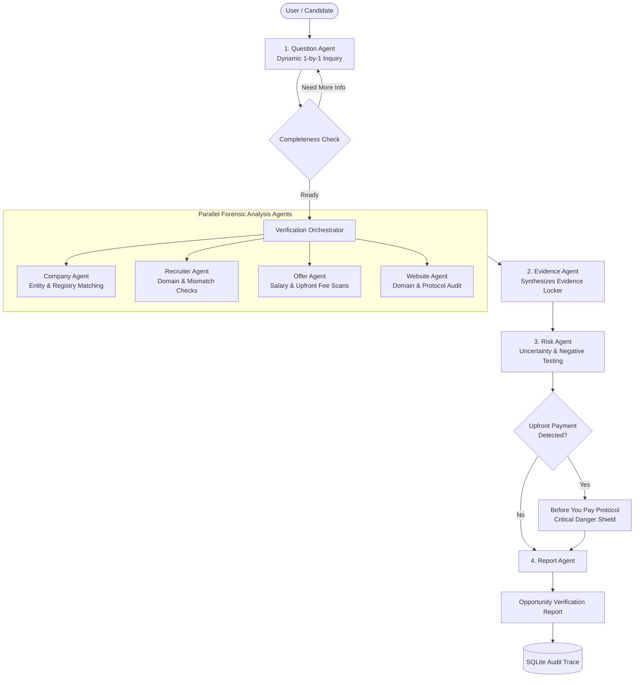

# TrustHire AI — System Architecture & Multi-Agent Design

## Overview
TrustHire AI is built around a central, responsible verification principle: **"Verify the opportunity, rather than detect fake companies."**

Rather than treating fraud detection as a fragile binary classification problem, TrustHire AI deploys a multi-agent orchestration architecture that collects forensic artifacts, cross-correlates multi-source evidence, enforces financial safety protocols, and provides full transparency through an Evidence Locker and deterministic Audit Trace.

## Multi-Step Agentic Lifecycle
1. **ASK**: Evaluates current parameters and generates dynamic, branching questions.
2. **COLLECT**: Gathers company names, recruitment channels, websites, recruiter contact, and message text.
3. **INVESTIGATE**: Performs entity lookups, domain parsing, and typosquatting analysis.
4. **ANALYZE**: Scans text for fee demands, urgency tactics, and premature banking requests.
5. **DECIDE**: Evaluates information completeness; if sparse, flags *Insufficient Evidence* without guessing.
6. **EXPLAIN**: Catalogs findings in the Evidence Locker under standardized categories.
7. **REPORT**: Generates multi-category Opportunity Verification Report.
8. **LOG**: Records deterministic audit trace entries into SQLite.
